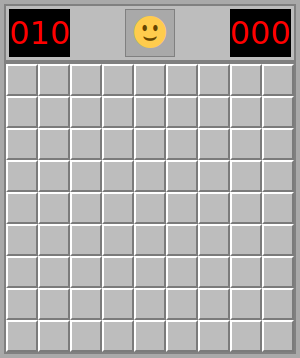
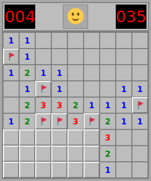
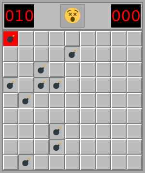
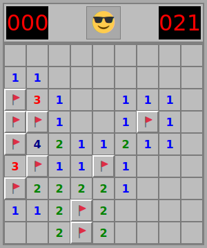

# Minesweeper

Minesweeper with HTML, CSS and vanilla JavaScript.






## Usage

```
npx http-server -c-1 ./src
```

&nbsp;  
Difficulty level can be selected through URL parameters, and defaults to beginner.

```
?level={intermediate|difficult|custom}
```

&nbsp;  
In case custom level is selected, width, height and mines count can be passed down by supplying extra parameters like so:

```
?level=custom&width={width}&height={height}&mines={minesCount}
```

## Author

- **Pierre-Alain Castella** - _Initial work_ - [metapho-re](https://github.com/metapho-re)

## License

This project is licensed under the MIT License - see the [LICENSE](LICENSE) file for details.
